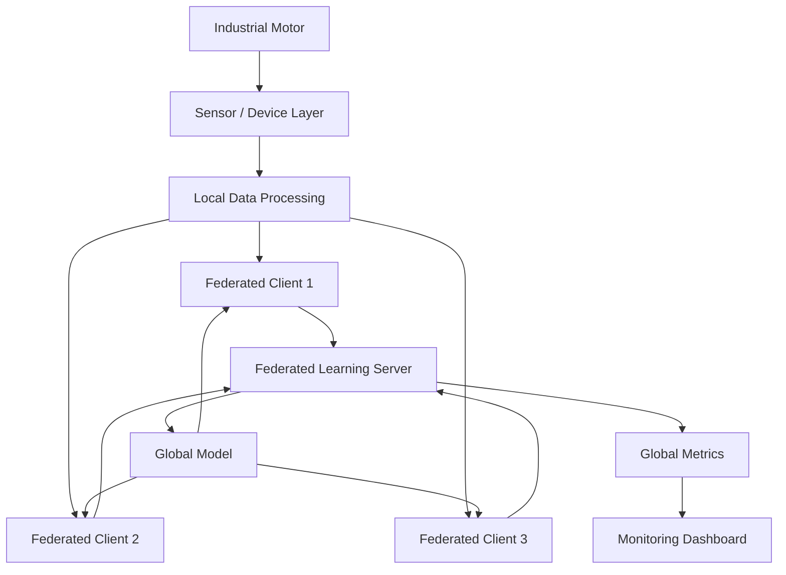
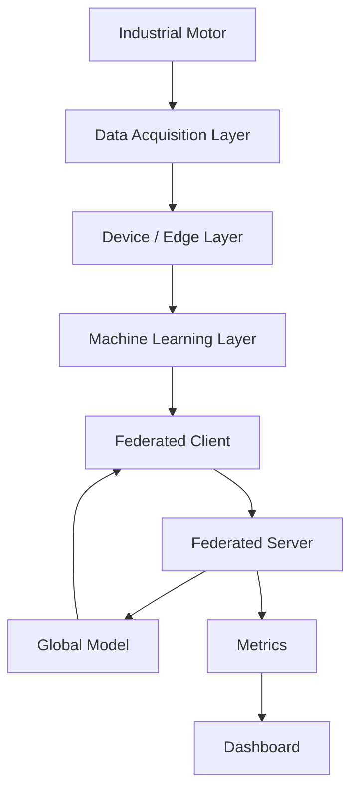
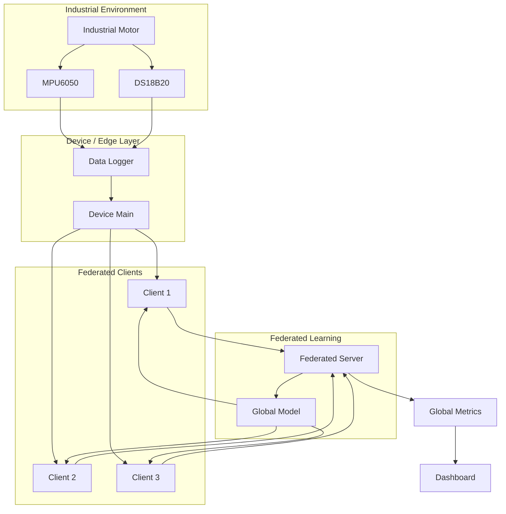
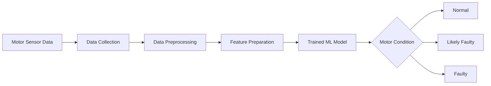
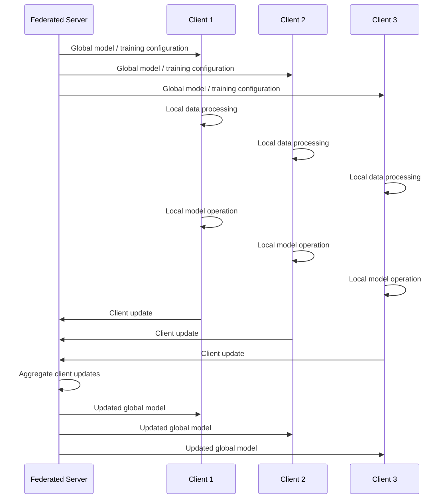
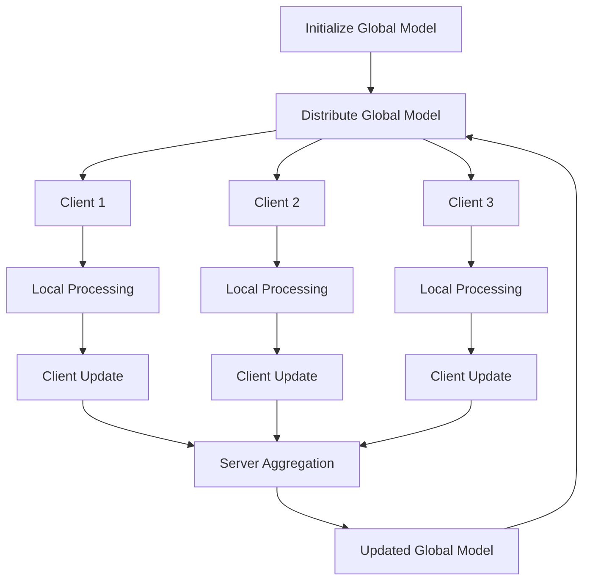
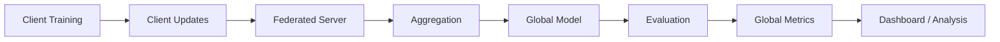
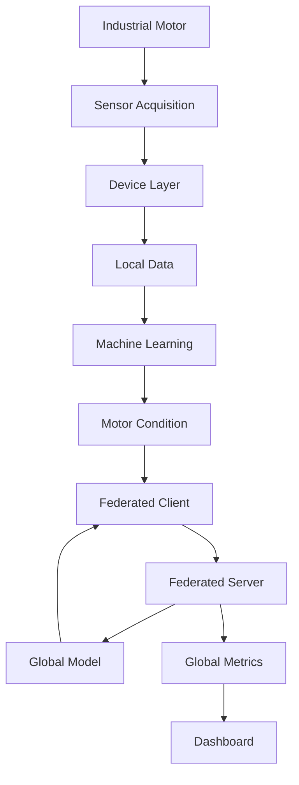

# 🏭 Vigilon — Secure Federated Learning for Industrial Predictive Maintenance


> **A federated industrial predictive-maintenance framework for motor condition monitoring using machine learning and edge-oriented data acquisition.**

Vigilon integrates **Industrial IoT, machine learning, edge data acquisition, and federated learning** to develop a collaborative motor-condition monitoring system.

The framework is designed around distributed clients where motor data can be processed locally while the federated-learning layer coordinates collaborative model training.

---

## 📋 Table of Contents

1. [Overview](#-overview)
2. [Problem Statement](#-problem-statement)
3. [Solution](#-solution)
4. [Project Objectives](#-project-objectives)
5. [Key Features](#-key-features)
6. [System Architecture](#-system-architecture)
7. [Industrial IoT Layer](#-industrial-iot-layer)
8. [Machine Learning Pipeline](#-machine-learning-pipeline)
9. [Federated Learning Architecture](#-federated-learning-architecture)
10. [Technology Stack](#-technology-stack)
11. [Dataset](#-dataset)
12. [Model Artifacts](#-model-artifacts)
13. [Project Structure](#-project-structure)
14. [Installation](#-installation)
15. [How to Run](#-how-to-run)
16. [Results](#-results)
17. [Future Improvements](#-future-improvements)
18. [Team](#-team)
19. [License](#-license)

---

# 🔭 Overview

**Vigilon** is an Industrial IoT and machine-learning framework focused on **motor condition monitoring and predictive maintenance**.

Industrial motors continuously generate operational data. Monitoring this data can help identify abnormal operating conditions and support early fault detection.

Vigilon combines:

- Industrial sensor data acquisition
- Edge/device-side processing
- Motor-condition datasets
- Machine-learning models
- Federated-learning clients
- Federated-learning server
- Monitoring dashboard
- Model evaluation and metrics

The project follows a distributed architecture in which multiple clients can participate in collaborative learning through a federated server.

### Core Concept



# 🚨 Problem Statement

Industrial predictive maintenance requires continuous monitoring of machine conditions.

However, industrial environments introduce several challenges:

| Challenge | Description |
|---|---|
| Distributed data | Data can originate from multiple machines or edge devices |
| Data privacy | Industrial sensor information may be sensitive |
| Fault detection | Abnormal operating conditions need to be identified |
| Distributed learning | Different clients may possess different local datasets |
| Continuous monitoring | Industrial systems require ongoing condition observation |
| Edge constraints | Data processing may need to happen close to the machine |

A centralized machine-learning architecture requires data to be collected at a common location for training.

Vigilon explores a federated-learning approach, where participating clients can contribute to collaborative model development without requiring their local datasets to be directly centralized.

---

# 💡 Solution

Vigilon separates the system into four major layers:



### Main Principle

Each participating client processes its local data and participates in the federated-learning workflow.

Instead of treating the federated server as the central storage location for all raw motor datasets, the architecture focuses on exchanging model-learning information between clients and the coordinating server.

---

# 🎯 Project Objectives

The main objectives of Vigilon are:

- Develop an industrial motor-condition monitoring framework.
- Process motor-related sensor data at the device/edge layer.
- Apply machine learning for motor-condition classification.
- Implement a federated-learning client/server architecture.
- Support multiple participating clients.
- Maintain local datasets at the client side during federated operation.
- Provide monitoring through a dashboard.
- Store and evaluate federated-learning metrics.
- Provide trained model artifacts for inference and deployment.
- Create an architecture suitable for future edge deployment.

---

# ✨ Key Features

### 🔹 Industrial IoT Data Acquisition

The device module provides the device-side components used for data acquisition and sensor interaction.

### 🔹 Motor Condition Classification

The machine-learning subsystem contains trained models and datasets for motor-condition analysis.

The current dataset categories include:

- Normal
- Likely Faulty
- Faulty

### 🔹 Federated Learning

The `federated/` module contains:

```text
federated/
├── client.py
└── server.py
```

The client and server form the core federated-learning communication layer.

### 🔹 Multiple Model Formats

The repository contains trained models in:

- H5
- TensorFlow Lite

This provides flexibility for experimentation and potential edge deployment.

### 🔹 Monitoring Dashboard

The `dashboard/` module contains the application used for system monitoring and visualization.

### 🔹 Metrics

Federated-learning results are stored under:

```text
results/metrics/
```

The repository retains the global metrics file:

```text
global_metrics.json
```

---

# 🏗️ System Architecture

### High-Level Architecture



# 🔌 Industrial IoT Layer

The device layer is located in:

```text
device/
├── main.py
├── data_logger.py
└── drivers/
    ├── ds18b20.py
    └── mpu6050.py
```

### Sensor Drivers

The repository contains drivers for:

**MPU6050**

Used for motion/vibration-related sensing.

**DS18B20**

Used for temperature sensing.

The device layer provides the interface between the physical sensing environment and the higher-level data-processing pipeline.

---

# 🧠 Machine Learning Pipeline

The overall pipeline can be represented as:



### ML Components

```text
ml/
├── dataset/
├── model.ipynb
└── saved_model/
```

The notebook contains the machine-learning development workflow, while the `saved_model/` directory contains trained model artifacts.

---

# 🌐 Federated Learning Architecture

The federated-learning implementation is located inside:

```text
federated/
├── client.py
└── server.py
```

The basic federated workflow is:



This process is repeated across federated-learning rounds.

---

# 🔄 Federated Learning Round

A simplified federated round consists of:



---

# 🛠️ Technology Stack

| Category | Technology |
|---|---|
| Programming Language | Python |
| Machine Learning | TensorFlow / Keras |
| Federated Learning | Flower |
| Data Processing | Pandas / NumPy |
| Configuration | YAML |
| Model Format | H5 |
| Edge Model Format | TensorFlow Lite |
| Hardware Interface | Python sensor drivers |
| Sensors | MPU6050, DS18B20 |
| Version Control | Git / GitHub |
| Development Environment | VS Code |

---

# 📊 Dataset

The project contains three motor-condition datasets:

```text
ml/dataset/
├── motor_data_normal.csv
├── motor_data_likely_faulty.csv
└── motor_data_faulty.csv
```

### Dataset Categories

| Dataset | Description |
|---|---|
| `motor_data_normal.csv` | Normal motor operating data |
| `motor_data_likely_faulty.csv` | Data representing likely abnormal/fault conditions |
| `motor_data_faulty.csv` | Fault-condition motor data |

The datasets are used as the data source for the machine-learning and federated-learning workflow.

---

# 🤖 Model Artifacts

The trained models are stored under:

```text
ml/saved_model/
```

Current model artifacts include:

```text
motor_condition_model.h5
motor_model.tflite
motor_model_v2_3class_motor.tflite
mpu5060_cnn_v2_3class_motor.h5
scaler.pkl
model_metrics_final.txt
```

### Model Formats

**H5**

Used for storing trained machine-learning models.

**TensorFlow Lite**

Provides a lightweight model representation suitable for potential edge deployment.

**Scaler**

The `scaler.pkl` file stores the preprocessing/scaling artifact used by the ML pipeline.

---

# 📊 Results Pipeline



---

# 🔮 Future Improvements

The following extensions can further develop the Vigilon framework:

### Edge Deployment

Deploy trained TensorFlow Lite models on Raspberry Pi or other embedded edge platforms.

### Real-Time Sensor Streaming

Connect physical sensors directly to the device layer for continuous motor monitoring.

### Expanded Fault Classification

Add additional motor fault categories and operating conditions.

### Secure Communication

Introduce authenticated and encrypted communication between federated clients and the server.

### Advanced Federated Aggregation

Evaluate additional aggregation strategies for heterogeneous industrial clients.

### Real-Time Alerts

Add automated alerts for detected abnormal motor conditions.

### Distributed Edge Deployment

Deploy multiple physical clients representing different industrial machines or locations.

---

# 🧩 Overall Project Workflow



---

## Vigilon — Industrial Predictive Maintenance

**Project Area**

Industrial IoT • Machine Learning • Federated Learning • Predictive Maintenance

---

# 📜 License

This project is currently provided for educational and project-development purposes.

A formal open-source license can be added to the repository if required.

---

# 🚀 Project Vision

Vigilon aims to combine industrial sensing, edge computing, machine learning, and federated learning into a distributed predictive-maintenance framework.

The long-term goal is to enable industrial machines to participate in collaborative intelligence while keeping machine-level data closer to its source.

**Sense locally. Learn collaboratively. Predict intelligently.**